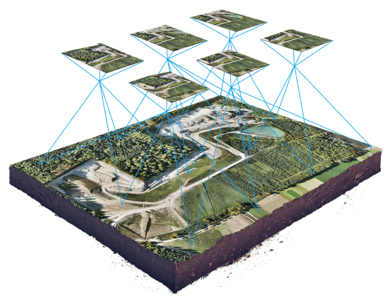
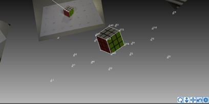
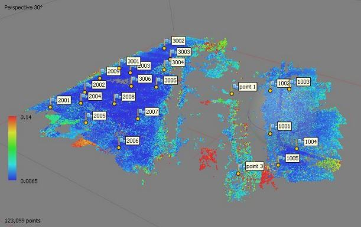
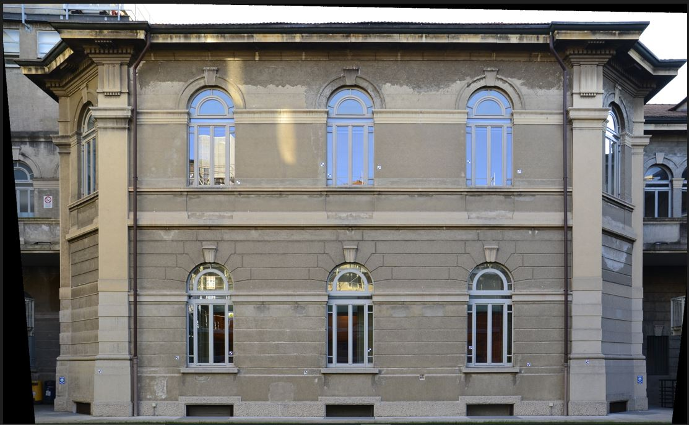
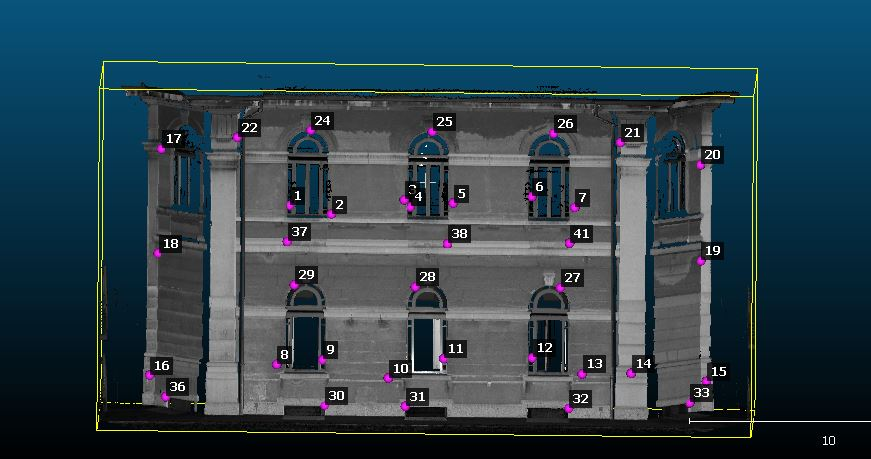
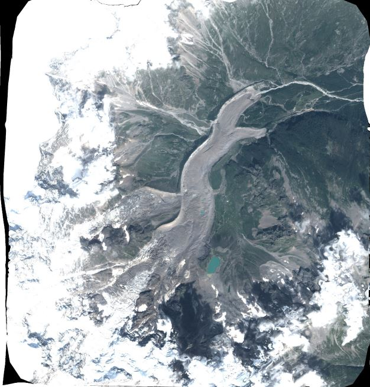
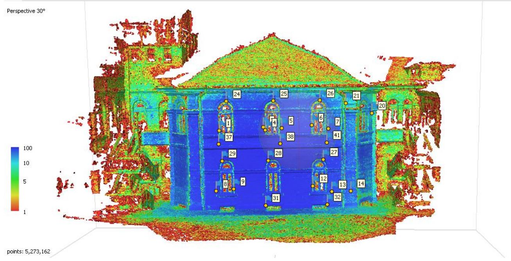

# Photogrammetry Lab

Welcome to the Photogrammetry Laboratory Repository! Here you'll find a collection of elaborate lab reports that I had to submit for the Photogrammetry course at Politecnico di Milano, covering a diverse range of topics and hands-on activities. Let's take a closer look at what each lab entails.

## Laboratory Activities

### 1. Digital camera calibration & 3D modelling of a simple object
The laboratory aimed to create a precise 3D model of a Rubik’s cube using Photomodeler software. Emphasizing the significance of camera calibration, photos were taken with a Nikon D3100, ensuring consistent parameters. Despite challenges like low-quality lighting, the calibration process revealed a total error exceeding the desired value. Outlier rejection improved the error, but subpar conditions prompted an accuracy test. The cube's homologous points were collimated, leading to a successful 3D model creation with satisfactory edge measurements, albeit challenges in area computations. The achieved Ground Sampling Distance (GSD) aligned closely with the caliper's accuracy.

    

### 2. Drone Survey & Orthophoto
The lab aimed to create a Digital Elevation Model (DEM) and orthophoto of a fluvial area near Cassano d’Adda using a UAV. Survey planning involved optimizing parameters for accuracy, with considerations for flight path, GSD, and image overlap. Challenges in image calibration were addressed, leading to a successful high-accuracy Bundle Block Adjustment (BBA). The resulting Point Cloud variance plot highlighted terrain variations, aiding Dense Point Cloud generation. A DEM was constructed, revealing distortions in non-flat areas. The orthomosaic showcased potential applications, such as testing self-driving car paths over uneven roads. Camera calibration was also performed for additional insights. The software used was **MetaShape**

    

### 3. Photoplane Reconstruction of a Facade via Drone

The lab aimed to create a photoplane of a building facade using an omography transformation. Initial considerations included planning for optimal photo quality. Ground Control Points (GCP) were obtained with a total station for accurate coordinates. The transformation equation was computed, filtering points based on protuberance acceptability. Residuals were computed and checked for accuracy. The rectified image was created, and considerations on excluding points higher than 0.035 m were verified, with improvements observed after outlier rejection. The software used was **RDF**

    

### 4. Laser Scanner Facade Survey
The lab focused on orienting a greyscale point cloud acquired via TLS during a survey of Politecnico’s building facade. The intensity values, without RGB sensors, revealed areas like grass and windows. A rototranslation process and ICP iteration aligned double points, refining accuracy. The registered scans were compared with a drone survey, highlighting differences in information and resolution between TLS and photogrammetry. The comparison revealed similar results, acknowledging the cost-effectiveness of photogrammetric instrumentation compared to TLS. The software used was **Cloud Compare**

    

### 5. Satellite Photogrammetry
The lab focused on monitoring the Belvedere glacier on Monte Rosa using satellite images from 2009 and 2017. Differences between satellite and drone survey costs and resolutions were highlighted. Pan-sharpening techniques were employed to enhance image quality. Additional markers were added for ground control points (GCP) to assess glacier volume changes. The DEM and orthophoto were computed, revealing a decrease in glacier volume over 8 years. Displacement of GCP indicated minimal movement, with noticeable changes near the glacier. The softwares used were **ArcGIS** and **MetaShape**

    

### 6. (extra) Orthophoto Computation of a Facade
In this optional project, the objective was to create an orthomosaic of Politecnico’s building 3 façade using Metashape and compare it with previous laboratory results. A drone survey provided nadiral and slightly inclined photos. Despite challenges in Bundle Block Adjustment (BBA) with check points, issues persisted in achieving the intended accuracy of 0.1m. The subsequent Point Cloud Variance and dense point cloud analysis revealed discrepancies. The project concluded with the creation of 3D and tiled models, highlighting differences in resolution and appearance. Finally, the orthomosaic was generated with specific settings for accurate representation.

    

